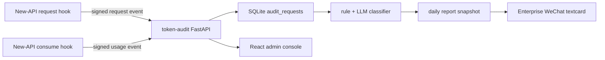

# Token Audit

New-API Token usage and work-purpose audit service.

Language: Chinese | [English](docs/i18n/README.en.md) | [日本語](docs/i18n/README.ja.md) | [한국어](docs/i18n/README.ko.md)

## 项目定位

`token-audit` 是一个独立运行的审计服务，用来接收 [Bigduang/new-api-audit](https://github.com/Bigduang/new-api-audit) 上报的请求事件和用量事件，按 `request_id` 合并 prompt、用户、token、模型、tokens、quota 等信息，保存到本地 SQLite，并在每天用量稳定后生成审计日报。

它解决的不是实时限流，而是事后可追溯：

- 统计一段时间内每个用户、每个 token 的请求数、Prompt Tokens、Completion Tokens、总 Tokens 和 quota。
- 判断请求是否用于工作，尤其是开发、调试、架构、部署、文档、代码审查、数据分析等场景。
- 对疑似非工作或无法判断的请求保留用户、token、模型、tokens、分类原因和 prompt 预览，方便复核。
- 提供轻量管理端，用来启用/停用审计用户、维护日报显示名、查看请求历史和完整 Prompt。
- 生成移动端友好的 HTML 日报，并通过企业微信 textcard 推送摘要和详情链接。
- 使用 SQLite 和 30 天保留策略，适合 VPS 上的小型公司内部中转站。

## 当前架构

New-API 侧只做极小 hook，不让审计服务影响正常请求：

1. 请求解析后，上报 request event：用户、token、模型、请求路径、prompt hash、prompt preview 和完整 prompt。
2. 消费结算后，上报 usage event：prompt tokens、completion tokens、quota、channel、group、耗时和上游 request id。
3. `token-audit` 用 `request_id` 做 upsert，即使 request/usage 先后顺序反过来也能关联。
4. 完整 prompt 使用 AES-GCM 加密保存到 SQLite；列表和日报默认只展示短预览。
5. 管理员登录管理端后，可以在请求历史弹窗中按需解密查看完整 Prompt。
6. 分类和日报一般在第二天早上运行，例如 `06:05 Asia/Shanghai` 审计前一天数据。



## 核心功能

- FastAPI 接收 New-API 内部审计事件。
- HMAC-SHA256 验签和时间窗防重放。
- SQLite WAL 模式，适合单机 VPS 部署。
- 覆盖索引优化总览、用户列表和请求历史查询，避免扫描加密 prompt 大字段。
- React + Vite + Tailwind 管理端，Docker 构建后由同一个 Python 容器托管静态文件。
- `audit_requests` 保存请求、用户/token、prompt 加密密文、用量和关联状态。
- `audit_users` 保存审计用户配置，不修改原始请求日志。
- `audit_classifications` 保存规则/LLM 分类结果和人工复核状态。
- `audit_user_work_summaries` 保存按用户归纳的工作内容。
- `audit_daily_reports` 保存日报 HTML、摘要 JSON、企业微信返回结果。
- `audit_events_deadletter` 保存验签失败、非法 payload、无法处理事件等异常。
- 企业微信 textcard 推送，避免企业微信 Markdown 渲染差的问题。
- 大数字在页面中自动压缩为 `K/M/B`，减少移动端占位。

## 管理端

管理端路径：

```text
https://ai-audit.example.com/admin/login
```

技术栈：

- Vite + React + TypeScript
- Tailwind CSS
- lucide-react
- react-markdown + remark-gfm

生产容器不运行 Node；Node 只在 Docker 多阶段构建中执行 `npm ci && npm run build`。

管理端能力：

- `/admin/dashboard`：审计总览，只展示稳定的实时统计和今日 Top5 用量，不展示当天未跑任务前容易误导的分类统计。
- `/admin/users`：历史发现用户、启用/停用审计、维护日报显示名和备注。
- `/admin/users/{identity}`：用户配置、用户统计和单用户请求历史。
- `/admin/requests`：全局请求历史，支持用户、token、模型、分类结论、时间范围筛选。
- `/admin/reports/daily`：按日期查看日报。

请求历史的 Prompt 处理：

- 列表中只展示短摘要，避免大字段拖慢页面。
- 点击某条请求时，单独调用详情接口。
- 详情接口优先解密 `prompt_ciphertext` 返回完整 Prompt，并用 Markdown 渲染。
- 若历史数据没有密文、解密失败或 New-API compact event 省略了完整 prompt，则回退显示预览并提示原因。

## 接口

New-API 调用的内部接口：

| Method | Path | 说明 |
| --- | --- | --- |
| `POST` | `/internal/new-api/audit/request` | 接收请求元数据和 prompt |
| `POST` | `/internal/new-api/audit/usage` | 接收最终 token/quota 用量 |

管理端接口：

| Method | Path | 说明 |
| --- | --- | --- |
| `GET` | `/admin/api/session` | 当前登录状态和 CSRF token |
| `POST` | `/admin/api/login` | 管理员登录 |
| `POST` | `/admin/api/logout` | 退出登录 |
| `GET` | `/admin/api/dashboard` | 审计总览统计 |
| `GET` | `/admin/api/users` | 审计用户列表 |
| `PATCH` | `/admin/api/users/{identity_key}` | 更新显示名、是否纳入审计、备注 |
| `POST` | `/admin/api/users/sync` | 从历史请求同步用户配置 |
| `GET` | `/admin/api/users/{identity_key}/requests` | 单用户请求历史 |
| `GET` | `/admin/api/requests` | 全局请求历史 |
| `GET` | `/admin/api/requests/{request_id}/preview` | 解密并返回完整 Prompt |
| `GET` | `/admin/api/report-url` | 管理端日报 iframe URL |

运维和报表接口：

| Method | Path | 说明 |
| --- | --- | --- |
| `GET` | `/health` | 健康检查 |
| `POST` | `/jobs/classify` | 对指定时间范围执行分类 |
| `POST` | `/jobs/summarize-work` | 按用户归纳当天做了哪些功能/工作 |
| `POST` | `/jobs/cleanup` | 删除超过保留期的数据 |
| `GET` | `/reports/token-usage` | 文本版用户/token 用量报告 |
| `GET` | `/reports/suspicious` | 文本版疑似非工作复核清单 |
| `GET` | `/reports/daily` | 受 token 保护的 HTML 日报 |
| `POST` | `/reports/push-wecom` | 保存日报快照并推送企业微信 |
| `PATCH` | `/audit-requests/{request_id}/review` | 人工复核请求分类 |

New-API 上报必须带：

```text
X-Audit-Timestamp: <unix timestamp>
X-Audit-Signature: hex(hmac_sha256(timestamp + "." + raw_body, AUDIT_SECRET))
```

## 数据表

主要 SQLite 表：

| 表 | 说明 |
| --- | --- |
| `audit_requests` | 请求、用户/token、prompt 加密密文、tokens、quota、关联状态 |
| `audit_users` | 审计用户配置，包含显示名、是否纳入日报、备注 |
| `audit_classifications` | 分类结果、工作/非工作结论、置信度、复核状态 |
| `audit_user_work_summaries` | LLM 按用户归纳的工作功能摘要 |
| `audit_daily_reports` | 日报 HTML 快照、摘要 JSON、企业微信返回结果 |
| `audit_events_deadletter` | 异常事件和无法处理的 payload |

`audit_users` 不删除；原始明细、分类、日报和工作摘要按 `AUDIT_RETENTION_DAYS` 清理。

## 配置

复制示例文件：

```bash
cp .env.example .env
```

生成 32 字节 prompt 加密密钥：

```bash
python - <<'PY'
import base64, os
print("base64:" + base64.b64encode(os.urandom(32)).decode())
PY
```

服务端核心配置：

| 变量 | 默认值 | 说明 |
| --- | --- | --- |
| `AUDIT_DATABASE_URL` | `sqlite:///./token_audit.db` | SQLAlchemy 数据库 URL，生产推荐 SQLite 文件 |
| `AUDIT_SECRET` | 空 | New-API 和审计服务共享的 HMAC 密钥，也用于派生管理端 cookie 签名密钥 |
| `AUDIT_PROMPT_ENCRYPTION_KEY` | 空 | AES-GCM 密钥，支持 `base64:`、`hex:` 或原始字符串 |
| `AUDIT_SIGNATURE_TOLERANCE_SECONDS` | `300` | 验签时间窗口 |
| `AUDIT_TIMEZONE` | `Asia/Shanghai` | 报表展示时区 |
| `AUDIT_RETENTION_DAYS` | `30` | 清理任务保留天数 |
| `AUDIT_MAX_BODY_BYTES` | `2097152` | 接收端最大请求体 |
| `AUDIT_PUBLIC_BASE_URL` | 空 | HTML 日报公网地址前缀 |
| `AUDIT_REPORT_ACCESS_TOKEN` | 空 | `/reports/daily` 访问 token |

管理端：

| 变量 | 默认值 | 说明 |
| --- | --- | --- |
| `AUDIT_ADMIN_USER` | 空 | 管理员用户名 |
| `AUDIT_ADMIN_PASSWORD` | 空 | 管理员密码 |
| `AUDIT_ADMIN_SESSION_TTL_SECONDS` | `43200` | 管理端登录 cookie 有效期 |

LLM 分类和工作摘要：

| 变量 | 说明 |
| --- | --- |
| `AUDIT_LLM_ENABLED` | 是否启用 OpenAI-compatible LLM |
| `AUDIT_LLM_BASE_URL` | 例如 `https://api.deepseek.com` |
| `AUDIT_LLM_API_KEY` | LLM API key，禁止提交到 git |
| `AUDIT_LLM_MODEL` | 例如 `deepseek-v4-flash` |
| `AUDIT_LLM_TIMEOUT_SECONDS` | 分类请求超时 |
| `AUDIT_LLM_MIN_CONFIDENCE` | 低于该置信度时保留规则结果或不覆盖 |

企业微信：

| 变量 | 说明 |
| --- | --- |
| `WX_CORPID` | 企业 ID |
| `WX_APPSECRET` | 应用 secret |
| `WX_AGENT_ID` | 应用 AgentId |

## Docker 部署

当前线上方案是 CPA + New-API + token-audit 同机 Docker 部署。推荐让 `token-audit` 加入 New-API 所在 Docker 网络，这样 New-API 使用服务名访问：

```env
AUDIT_ENDPOINT=http://token-audit:8000
```

构建并启动：

```bash
mkdir -p data
docker compose -f deploy/docker-compose.yml build
docker compose -f deploy/docker-compose.yml up -d
docker logs -f token-audit
```

`deploy/docker-compose.yml` 默认加入外部网络 `proxy_newapi-network`。如果你的 New-API compose 项目网络名不同，需要改这里：

```yaml
networks:
  newapi-network:
    external: true
    name: proxy_newapi-network
```

容器入口会先执行：

```bash
python -m token_audit.cli migrate
```

然后启动 Uvicorn。

## New-API 对接

推荐使用已经包含审计 hook 的 [Bigduang/new-api-audit](https://github.com/Bigduang/new-api-audit)，而不是在服务器上手工打补丁。仓库中 `patches/new-api-audit-hook.patch` 保留为历史参考和二开对照。

New-API 侧配置：

```env
AUDIT_ENABLED=true
AUDIT_ENDPOINT=http://token-audit:8000
AUDIT_SECRET=<same-as-token-audit>
AUDIT_TIMEOUT_MS=800
AUDIT_QUEUE_SIZE=1000
AUDIT_MAX_EVENT_BYTES=1048576
AUDIT_EXCLUDED_TOKEN_NAMES=audit-classifier
```

上线建议：

1. 先部署 `token-audit`，确认 `/health` 正常。
2. New-API 先以 `AUDIT_ENABLED=false` 部署新镜像。
3. 开启 `AUDIT_ENABLED=true` 做 shadow 上报。
4. 观察 New-API health、容器日志、token-audit 入库和 deadletter。
5. 确认 request/usage 关联完整后启用日报 cron。

审计 sender 是非阻塞队列。审计服务不可用、队列满或单条事件过大时，New-API 只记录日志或发送 compact event，不应阻断用户请求。

## 日常任务

分类当天数据：

```bash
python -m token_audit.cli classify --start 2026-06-02 --end 2026-06-02
```

归纳指定日期每个人在做什么功能：

```bash
python -m token_audit.cli summarize-work --start 2026-06-02 --end 2026-06-02
```

保存日报快照但不推送：

```bash
python -m token_audit.cli save-report --start 2026-06-02 --end 2026-06-02
```

推送企业微信日报：

```bash
python -m token_audit.cli push-wecom --start 2026-06-02 --end 2026-06-02
```

清理过期数据：

```bash
python -m token_audit.cli cleanup
```

Docker 线上脚本：

```bash
/opt/token-audit/deploy/scripts/run-daily-audit.sh 2026-06-02
```

推荐 cron：

```cron
05 6 * * * /opt/token-audit/deploy/scripts/run-daily-audit.sh >> /opt/token-audit/data/daily-audit.log 2>&1
```

该脚本会依次执行：

1. `classify`
2. `summarize-work`
3. `push-wecom`
4. `cleanup`

分类不是实时执行。当天管理端请求历史可能暂时显示“未分类”，这是预期行为；第二天早上任务跑完后，日报和复核清单会使用分类结果。

## 报表访问

日报详情页：

```text
https://ai-audit.example.com/reports/daily?date=2026-06-02&token=<AUDIT_REPORT_ACCESS_TOKEN>
```

也可以用 HTTP 接口：

```bash
curl 'http://localhost:8000/reports/token-usage?start=2026-06-02&end=2026-06-02'
curl 'http://localhost:8000/reports/suspicious?start=2026-06-02&end=2026-06-02'
curl -X POST 'http://localhost:8000/jobs/classify?start=2026-06-02&end=2026-06-02'
curl -X POST 'http://localhost:8000/jobs/summarize-work?start=2026-06-02&end=2026-06-02'
```

公网 Nginx 不建议暴露 `/jobs/*`、`/reports/token-usage`、`/reports/suspicious`。如果必须暴露，请增加额外认证。公网通常只代理 `/admin/*` 和 `/reports/daily`，其中 `/admin/*` 自带管理员登录，`/reports/daily` 依赖 `AUDIT_REPORT_ACCESS_TOKEN`。

## 人工复核

```bash
curl -X PATCH http://localhost:8000/audit-requests/<request_id>/review \
  -H 'Content-Type: application/json' \
  -d '{"review_status":"confirmed","review_note":"非工作闲聊","reviewed_by":"admin"}'
```

`review_status` 可选：

- `pending`
- `confirmed`
- `false_positive`
- `ignored`

## 本地开发

后端：

```bash
python -m venv .venv
. .venv/bin/activate
pip install -e .
pip install -r requirements-dev.txt
pytest -q
```

前端：

```bash
cd frontend/admin
npm ci
npm run build
```

本地启动：

```bash
export $(grep -v '^#' .env | xargs)
python -m token_audit.cli migrate
uvicorn token_audit.main:app --host 0.0.0.0 --port 8000
```

## 安全注意事项

- 不要提交 `.env`、SQLite 数据库、日志、日报导出或真实 API key。
- `AUDIT_PROMPT_ENCRYPTION_KEY` 丢失后无法解密历史完整 prompt，必须妥善备份。
- 请求历史列表、日报和企业微信推送默认只展示 prompt 预览。
- 管理端完整 Prompt 查看需要管理员登录，且只在点击单条请求时解密。
- LLM 分类和工作摘要使用规则筛选后的 prompt 内容；分类器自身 token 应加入 `AUDIT_EXCLUDED_TOKEN_NAMES`。
- 企业微信推送只发摘要卡片，完整详情留在受 token 保护的 HTML 页面。

## 当前线上约定

- 数据库：SQLite。
- 详细数据保留：30 天。
- 审计时间：每天早上约 06:05，处理前一天数据。
- 管理端路径：`/admin/login`。
- New-API 正常流量优先，审计失败不能影响中转站可用性。

## 友情链接

- [LINUX DO](https://linux.do/)：高质量技术社区。

## License

This project is open-sourced under the [MIT License](LICENSE).
