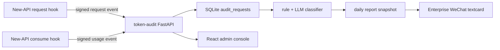

# Token Audit

New-API token usage and work-purpose audit service.

Languages: [中文](../../README.md) | English | [日本語](README.ja.md) | [한국어](README.ko.md)

## Purpose

`token-audit` is an independent audit service. It receives request and usage events from [Bigduang/new-api-audit](https://github.com/Bigduang/new-api-audit), joins prompt, user, token, model, tokens, and quota by `request_id`, stores them in local SQLite, and generates daily audit reports after usage data stabilizes.

It is designed for traceability after the fact, not real-time rate limiting:

- Report request counts, Prompt Tokens, Completion Tokens, total Tokens, and quota by user and token.
- Judge whether requests were used for work, especially development, debugging, architecture, deployment, documentation, code review, and data analysis.
- Keep user, token, model, tokens, classification reason, and prompt preview for suspected non-work or uncertain requests.
- Provide a lightweight admin console for enabling/disabling audited users, editing daily-report display names, viewing request history, and opening full prompts.
- Generate mobile-friendly HTML daily reports and push Enterprise WeChat textcard summaries.
- Use SQLite and a 30-day retention policy, suitable for small company relay stacks on VPS hosts.

## Current Architecture

The New-API side only adds minimal hooks so the audit service cannot affect normal requests:

1. After request parsing, New-API reports a request event: user, token, model, request path, prompt hash, prompt preview, and full prompt.
2. After usage settlement, New-API reports a usage event: prompt tokens, completion tokens, quota, channel, group, duration, and upstream request id.
3. `token-audit` upserts by `request_id`, so request/usage events can arrive in either order.
4. Full prompts are encrypted with AES-GCM in SQLite; lists and reports show short previews by default.
5. After admin login, the request-history dialog can decrypt and display the full prompt on demand.
6. Classification and reports usually run the next morning, for example `06:05 Asia/Shanghai`, against the previous day.



## Core Features

- FastAPI receiver for New-API internal audit events.
- HMAC-SHA256 verification and timestamp replay window.
- SQLite WAL mode for single-node VPS deployment.
- Covering indexes optimized for dashboard, user list, and request-history queries.
- React + Vite + Tailwind admin console, built in Docker and served by the same Python container.
- `audit_requests` stores requests, users/tokens, encrypted prompt ciphertext, usage, and association status.
- `audit_users` stores audit-user configuration without modifying raw request logs.
- `audit_classifications` stores rule/LLM classification results and manual review status.
- `audit_user_work_summaries` stores per-user work summaries.
- `audit_daily_reports` stores daily report HTML, summary JSON, and Enterprise WeChat response data.
- `audit_events_deadletter` stores signature failures, invalid payloads, and unhandled events.
- Enterprise WeChat textcard delivery, avoiding poor Markdown rendering in WeChat.
- Large numbers are compacted as `K/M/B` in the UI.

## Admin Console

Admin path:

```text
https://ai-audit.example.com/admin/login
```

Frontend stack:

- Vite + React + TypeScript
- Tailwind CSS
- lucide-react
- react-markdown + remark-gfm

The production container does not run Node. Node is used only during the Docker multi-stage build to run `npm ci && npm run build`.

Admin capabilities:

- `/admin/dashboard`: audit overview with stable live stats and today's Top 5 usage; it does not show classification stats before the daily jobs run.
- `/admin/users`: discover historical users, enable/disable auditing, edit daily-report display names and notes.
- `/admin/users/{identity}`: user configuration, user stats, and single-user request history.
- `/admin/requests`: global request history with filters for user, token, model, verdict, and time range.
- `/admin/reports/daily`: view daily reports by date.

Prompt handling in request history:

- Lists show only short summaries to avoid loading large fields.
- Clicking a request calls a separate detail endpoint.
- The detail endpoint prefers decrypting `prompt_ciphertext` and renders the full prompt as Markdown.
- If old data has no ciphertext, decryption fails, or New-API sent a compact event, it falls back to the preview and explains why.

## API

Internal New-API endpoints:

| Method | Path | Description |
| --- | --- | --- |
| `POST` | `/internal/new-api/audit/request` | Receive request metadata and prompt |
| `POST` | `/internal/new-api/audit/usage` | Receive final token/quota usage |

Admin endpoints:

| Method | Path | Description |
| --- | --- | --- |
| `GET` | `/admin/api/session` | Current login state and CSRF token |
| `POST` | `/admin/api/login` | Admin login |
| `POST` | `/admin/api/logout` | Logout |
| `GET` | `/admin/api/dashboard` | Audit overview stats |
| `GET` | `/admin/api/users` | Audit user list |
| `PATCH` | `/admin/api/users/{identity_key}` | Update display name, audit flag, and notes |
| `POST` | `/admin/api/users/sync` | Sync user config from historical requests |
| `GET` | `/admin/api/users/{identity_key}/requests` | Single-user request history |
| `GET` | `/admin/api/requests` | Global request history |
| `GET` | `/admin/api/requests/{request_id}/preview` | Decrypt and return the full prompt |
| `GET` | `/admin/api/report-url` | Daily report iframe URL for the admin console |

Operations and report endpoints:

| Method | Path | Description |
| --- | --- | --- |
| `GET` | `/health` | Health check |
| `POST` | `/jobs/classify` | Classify requests in a date range |
| `POST` | `/jobs/summarize-work` | Summarize each user's work items |
| `POST` | `/jobs/cleanup` | Delete data older than retention |
| `GET` | `/reports/token-usage` | Plain-text usage report |
| `GET` | `/reports/suspicious` | Plain-text suspicious request list |
| `GET` | `/reports/daily` | Token-protected HTML daily report |
| `POST` | `/reports/push-wecom` | Save report snapshot and push Enterprise WeChat |
| `PATCH` | `/audit-requests/{request_id}/review` | Manually review a classification |

Signed New-API requests must include:

```text
X-Audit-Timestamp: <unix timestamp>
X-Audit-Signature: hex(hmac_sha256(timestamp + "." + raw_body, AUDIT_SECRET))
```

## Database Tables

Main SQLite tables:

| Table | Description |
| --- | --- |
| `audit_requests` | Request, user/token, encrypted prompt ciphertext, tokens, quota, and association status |
| `audit_users` | Audit-user config: display name, included in daily report, notes |
| `audit_classifications` | Category, work/non-work verdict, confidence, and review status |
| `audit_user_work_summaries` | LLM-generated per-user work summaries |
| `audit_daily_reports` | Daily report HTML snapshots, summary JSON, Enterprise WeChat response |
| `audit_events_deadletter` | Failed or invalid payloads |

`audit_users` is retained long term. Raw details, classifications, reports, and work summaries are cleaned by `AUDIT_RETENTION_DAYS`.

## Configuration

Copy the template:

```bash
cp .env.example .env
```

Generate a 32-byte prompt encryption key:

```bash
python - <<'PY'
import base64, os
print("base64:" + base64.b64encode(os.urandom(32)).decode())
PY
```

Core server variables:

| Variable | Default | Description |
| --- | --- | --- |
| `AUDIT_DATABASE_URL` | `sqlite:///./token_audit.db` | SQLAlchemy database URL; production usually uses a SQLite file |
| `AUDIT_SECRET` | empty | Shared HMAC secret between New-API and this service; also derives the admin cookie signing key |
| `AUDIT_PROMPT_ENCRYPTION_KEY` | empty | AES-GCM key. Supports `base64:`, `hex:`, or raw text |
| `AUDIT_SIGNATURE_TOLERANCE_SECONDS` | `300` | Signature timestamp window |
| `AUDIT_TIMEZONE` | `Asia/Shanghai` | Report display timezone |
| `AUDIT_RETENTION_DAYS` | `30` | Retention period |
| `AUDIT_MAX_BODY_BYTES` | `2097152` | Maximum inbound payload size |
| `AUDIT_PUBLIC_BASE_URL` | empty | Public base URL for HTML report links |
| `AUDIT_REPORT_ACCESS_TOKEN` | empty | Access token for `/reports/daily` |

Admin console:

| Variable | Default | Description |
| --- | --- | --- |
| `AUDIT_ADMIN_USER` | empty | Admin username |
| `AUDIT_ADMIN_PASSWORD` | empty | Admin password |
| `AUDIT_ADMIN_SESSION_TTL_SECONDS` | `43200` | Admin cookie lifetime |

LLM classification and work summaries:

| Variable | Description |
| --- | --- |
| `AUDIT_LLM_ENABLED` | Enable OpenAI-compatible LLM |
| `AUDIT_LLM_BASE_URL` | Example: `https://api.deepseek.com` |
| `AUDIT_LLM_API_KEY` | LLM API key; never commit it |
| `AUDIT_LLM_MODEL` | Example: `deepseek-v4-flash` |
| `AUDIT_LLM_TIMEOUT_SECONDS` | Classification request timeout |
| `AUDIT_LLM_MIN_CONFIDENCE` | Keep the rule result or avoid overriding below this confidence |

Enterprise WeChat:

| Variable | Description |
| --- | --- |
| `WX_CORPID` | Corporate ID |
| `WX_APPSECRET` | App secret |
| `WX_AGENT_ID` | App AgentId |

## Docker Deployment

The current production pattern is CPA + New-API + token-audit on the same Docker host. Join the same Docker network as New-API so New-API can use the service name:

```env
AUDIT_ENDPOINT=http://token-audit:8000
```

Build and start:

```bash
mkdir -p data
docker compose -f deploy/docker-compose.yml build
docker compose -f deploy/docker-compose.yml up -d
docker logs -f token-audit
```

`deploy/docker-compose.yml` joins the external network `proxy_newapi-network` by default. Change this if your New-API compose project uses a different network name:

```yaml
networks:
  newapi-network:
    external: true
    name: proxy_newapi-network
```

The container entrypoint runs:

```bash
python -m token_audit.cli migrate
```

before starting Uvicorn.

## New-API Integration

Use the [Bigduang/new-api-audit](https://github.com/Bigduang/new-api-audit) fork that already contains the audit hook, rather than manually patching the server. `patches/new-api-audit-hook.patch` is kept only as historical reference.

Recommended New-API variables:

```env
AUDIT_ENABLED=true
AUDIT_ENDPOINT=http://token-audit:8000
AUDIT_SECRET=<same-as-token-audit>
AUDIT_TIMEOUT_MS=800
AUDIT_QUEUE_SIZE=1000
AUDIT_MAX_EVENT_BYTES=1048576
AUDIT_EXCLUDED_TOKEN_NAMES=audit-classifier
```

Recommended rollout:

1. Deploy `token-audit` and confirm `/health`.
2. Deploy the New-API fork image with `AUDIT_ENABLED=false`.
3. Enable `AUDIT_ENABLED=true` for shadow reporting.
4. Watch New-API health, container logs, token-audit ingestion, and deadletter rows.
5. Enable the daily cron after request/usage association is complete.

The audit sender is a non-blocking queue. If the audit service is unavailable, the queue is full, or an event is too large, New-API only logs the issue or sends a compact event; it should not block user requests.

## Daily Jobs

Classify a date:

```bash
python -m token_audit.cli classify --start 2026-06-02 --end 2026-06-02
```

Summarize what each person worked on:

```bash
python -m token_audit.cli summarize-work --start 2026-06-02 --end 2026-06-02
```

Save a report snapshot without pushing:

```bash
python -m token_audit.cli save-report --start 2026-06-02 --end 2026-06-02
```

Push Enterprise WeChat daily report:

```bash
python -m token_audit.cli push-wecom --start 2026-06-02 --end 2026-06-02
```

Cleanup expired data:

```bash
python -m token_audit.cli cleanup
```

Docker production script:

```bash
/opt/token-audit/deploy/scripts/run-daily-audit.sh 2026-06-02
```

Suggested cron:

```cron
05 6 * * * /opt/token-audit/deploy/scripts/run-daily-audit.sh >> /opt/token-audit/data/daily-audit.log 2>&1
```

The script runs `classify`, `summarize-work`, `push-wecom`, and `cleanup`.

Classification is not real time. Today's request history may temporarily show "unclassified"; this is expected until the next morning's job finishes.

## Report Access

Daily report URL:

```text
https://ai-audit.example.com/reports/daily?date=2026-06-02&token=<AUDIT_REPORT_ACCESS_TOKEN>
```

HTTP examples:

```bash
curl 'http://localhost:8000/reports/token-usage?start=2026-06-02&end=2026-06-02'
curl 'http://localhost:8000/reports/suspicious?start=2026-06-02&end=2026-06-02'
curl -X POST 'http://localhost:8000/jobs/classify?start=2026-06-02&end=2026-06-02'
curl -X POST 'http://localhost:8000/jobs/summarize-work?start=2026-06-02&end=2026-06-02'
```

Public nginx should not normally expose `/jobs/*`, `/reports/token-usage`, or `/reports/suspicious`. If they must be exposed, add extra authentication. Public access should usually proxy only `/admin/*` and `/reports/daily`; `/admin/*` has admin login and `/reports/daily` uses `AUDIT_REPORT_ACCESS_TOKEN`.

## Manual Review

```bash
curl -X PATCH http://localhost:8000/audit-requests/<request_id>/review \
  -H 'Content-Type: application/json' \
  -d '{"review_status":"confirmed","review_note":"non-work chat","reviewed_by":"admin"}'
```

Allowed `review_status` values:

- `pending`
- `confirmed`
- `false_positive`
- `ignored`

## Development

Backend:

```bash
python -m venv .venv
. .venv/bin/activate
pip install -e .
pip install -r requirements-dev.txt
pytest -q
```

Frontend:

```bash
cd frontend/admin
npm ci
npm run build
```

Local startup:

```bash
export $(grep -v '^#' .env | xargs)
python -m token_audit.cli migrate
uvicorn token_audit.main:app --host 0.0.0.0 --port 8000
```

## Security Notes

- Never commit `.env`, SQLite databases, logs, exported reports, or real API keys.
- Back up `AUDIT_PROMPT_ENCRYPTION_KEY`; historical full prompts cannot be decrypted without it.
- Request history, reports, and Enterprise WeChat pushes show prompt previews by default.
- Full prompt viewing requires admin login and decrypts only when opening a single request.
- LLM classification and work summaries use rule-filtered prompt content; add the classifier token name to `AUDIT_EXCLUDED_TOKEN_NAMES`.
- Enterprise WeChat pushes only send summary cards; full details stay in the token-protected HTML page.

## Current Production Convention

- Database: SQLite.
- Detail retention: 30 days.
- Audit time: around 06:05 each morning, processing the previous day.
- Admin path: `/admin/login`.
- New-API traffic has priority; audit failures must not affect relay availability.

## Friendly Links

- [LinuxDO](https://linux.do/): A high-quality technical community.

## License

This project is open-sourced under the [MIT License](../../LICENSE).
