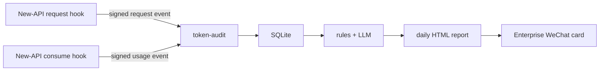

# Token Audit

Independent token usage and work-purpose audit service for New-API.

Languages: [中文](../../README.md) | English | [日本語](README.ja.md) | [한국어](README.ko.md)

## Purpose

`token-audit` receives signed audit events from a small New-API fork, joins request and usage events by `request_id`, stores them in local SQLite, classifies whether the request was work-related, and generates daily audit reports.

The service is designed for a small company relay stack running on a VPS. It favors availability and traceability over real-time blocking: New-API must continue serving users even if the audit endpoint is temporarily unavailable.

## What It Tracks

- Per-user and per-token request counts.
- Prompt tokens, completion tokens, total tokens, and quota.
- Model and request path distribution.
- Work, non-work, uncertain, and unclassified verdict counts.
- Suspicious or uncertain requests with user, token, model, reason, review status, and prompt preview.
- Per-user work summaries generated from prompt previews.
- Daily HTML report snapshots and Enterprise WeChat delivery results.

## Data Flow

1. New-API sends a request event after parsing the inbound request.
2. New-API sends a usage event after consume-log settlement.
3. `token-audit` upserts both events by `request_id`.
4. Full prompt text is encrypted with AES-GCM; reports show only prompt previews by default.
5. Classification and daily report jobs usually run the next morning for the previous day.



## API

Internal New-API endpoints:

| Method | Path | Description |
| --- | --- | --- |
| `POST` | `/internal/new-api/audit/request` | Receive request metadata and prompt content |
| `POST` | `/internal/new-api/audit/usage` | Receive final token/quota usage |

Operations and reports:

| Method | Path | Description |
| --- | --- | --- |
| `GET` | `/health` | Health check |
| `POST` | `/jobs/classify` | Classify requests in a date range |
| `POST` | `/jobs/summarize-work` | Summarize each user's work items |
| `POST` | `/jobs/cleanup` | Delete data older than retention |
| `GET` | `/reports/token-usage` | Plain-text usage report |
| `GET` | `/reports/suspicious` | Plain-text suspicious request list |
| `GET` | `/reports/daily` | Token-protected HTML daily report |
| `POST` | `/reports/push-wecom` | Save report snapshot and push Enterprise WeChat |
| `PATCH` | `/audit-requests/{request_id}/review` | Manually review a classification |

Signed requests must include:

```text
X-Audit-Timestamp: <unix timestamp>
X-Audit-Signature: hex(hmac_sha256(timestamp + "." + raw_body, AUDIT_SECRET))
```

## Configuration

Copy the template and generate a prompt encryption key:

```bash
cp .env.example .env
python - <<'PY'
import base64, os
print("base64:" + base64.b64encode(os.urandom(32)).decode())
PY
```

Core variables:

| Variable | Description |
| --- | --- |
| `AUDIT_DATABASE_URL` | SQLAlchemy URL. Production usually uses a SQLite file. |
| `AUDIT_SECRET` | Shared HMAC secret between New-API and this service. |
| `AUDIT_PROMPT_ENCRYPTION_KEY` | AES-GCM key. Supports `base64:`, `hex:`, or raw text. |
| `AUDIT_TIMEZONE` | Report timezone, usually `Asia/Shanghai`. |
| `AUDIT_RETENTION_DAYS` | Retention period, usually 30 days. |
| `AUDIT_MAX_BODY_BYTES` | Maximum inbound payload size. |
| `AUDIT_PUBLIC_BASE_URL` | Public base URL for report links. |
| `AUDIT_REPORT_ACCESS_TOKEN` | Access token for `/reports/daily`. |

Optional OpenAI-compatible LLM:

| Variable | Description |
| --- | --- |
| `AUDIT_LLM_ENABLED` | Enable LLM classification and work summaries. |
| `AUDIT_LLM_BASE_URL` | Example: `https://api.deepseek.com`. |
| `AUDIT_LLM_API_KEY` | LLM API key. Never commit it. |
| `AUDIT_LLM_MODEL` | Example: `deepseek-v4-flash`. |
| `AUDIT_LLM_TIMEOUT_SECONDS` | Request timeout. |
| `AUDIT_LLM_MIN_CONFIDENCE` | Minimum confidence threshold. |

Enterprise WeChat variables:

| Variable | Description |
| --- | --- |
| `WX_CORPID` | Corporate ID |
| `WX_APPSECRET` | App secret |
| `WX_AGENT_ID` | App AgentId |

## Docker Deployment

Join the same Docker network as New-API so the fork can call:

```env
AUDIT_ENDPOINT=http://token-audit:8000
```

Start the service:

```bash
mkdir -p data
docker compose -f deploy/docker-compose.yml build
docker compose -f deploy/docker-compose.yml up -d
docker logs -f token-audit
```

The compose file expects an external network named `proxy_newapi-network`. Change `deploy/docker-compose.yml` if your New-API network name is different.

The Docker entrypoint runs migrations before starting Uvicorn.

## New-API Integration

Recommended New-API variables:

```env
AUDIT_ENABLED=true
AUDIT_ENDPOINT=http://token-audit:8000
AUDIT_SECRET=<same-as-token-audit>
AUDIT_TIMEOUT_MS=800
AUDIT_QUEUE_SIZE=1000
AUDIT_MAX_EVENT_BYTES=1048576
AUDIT_EXCLUDED_TOKEN_NAMES=audit-classifier
```

The New-API audit sender is non-blocking. If the endpoint is down, the queue is full, or a payload is too large, New-API drops or compacts the audit event and continues serving the user request.

## Daily Jobs

Run for a specific date:

```bash
python -m token_audit.cli classify --start 2026-06-02 --end 2026-06-02
python -m token_audit.cli summarize-work --start 2026-06-02 --end 2026-06-02
python -m token_audit.cli push-wecom --start 2026-06-02 --end 2026-06-02
python -m token_audit.cli cleanup
```

Docker helper:

```bash
/opt/token-audit/deploy/scripts/run-daily-audit.sh 2026-06-02
```

Suggested cron:

```cron
05 6 * * * /opt/token-audit/deploy/scripts/run-daily-audit.sh >> /opt/token-audit/data/daily-audit.log 2>&1
```

## Development

```bash
python -m venv .venv
. .venv/bin/activate
pip install -e .
pip install -r requirements-dev.txt
pytest -q
```

## Security Notes

- Never commit `.env`, SQLite databases, logs, exported reports, or real API keys.
- Back up `AUDIT_PROMPT_ENCRYPTION_KEY`; historical prompts cannot be decrypted without it.
- Public nginx should normally expose only `/reports/daily`, protected by `AUDIT_REPORT_ACCESS_TOKEN`.
- LLM work summaries use prompt previews, not decrypted full prompts.
- Add the classifier token name to `AUDIT_EXCLUDED_TOKEN_NAMES` to avoid polluting employee usage statistics.
