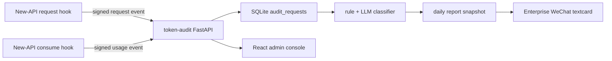

# Token Audit

New-API 向けの Token 使用量および業務利用監査サービスです。

言語： [中文](../../README.md) | [English](README.en.md) | 日本語 | [한국어](README.ko.md)

## 目的

`token-audit` は独立して動作する監査サービスです。[Bigduang/new-api-audit](https://github.com/Bigduang/new-api-audit) から request event と usage event を受け取り、`request_id` で prompt、ユーザー、token、モデル、tokens、quota などを結合し、ローカル SQLite に保存します。利用量が安定した後、日次監査レポートを生成します。

リアルタイム制限ではなく、事後追跡を目的としています：

- ユーザー別、token 別にリクエスト数、Prompt Tokens、Completion Tokens、Total Tokens、quota を集計します。
- 開発、デバッグ、アーキテクチャ、デプロイ、ドキュメント、コードレビュー、データ分析など、業務利用かどうかを判定します。
- 疑似非業務または判断不能なリクエストについて、ユーザー、token、モデル、tokens、分類理由、prompt preview を残します。
- 監査対象ユーザーの有効化/無効化、日報表示名の編集、リクエスト履歴、完全 Prompt 表示のための軽量管理画面を提供します。
- モバイル向け HTML 日報を生成し、Enterprise WeChat textcard で概要と詳細リンクを送信します。
- SQLite と 30 日保持ポリシーを使い、VPS 上の小規模社内中継環境に適しています。

## 現在のアーキテクチャ

New-API 側は最小限の hook のみを追加し、監査サービスが通常リクエストに影響しないようにしています：

1. リクエスト解析後、New-API は request event を送信します：ユーザー、token、モデル、リクエストパス、prompt hash、prompt preview、完全 prompt。
2. 利用量精算後、New-API は usage event を送信します：prompt tokens、completion tokens、quota、channel、group、処理時間、upstream request id。
3. `token-audit` は `request_id` で upsert するため、request/usage の到着順が逆でも関連付けできます。
4. 完全 prompt は AES-GCM で SQLite に暗号化保存され、一覧とレポートでは短い preview のみ表示します。
5. 管理者ログイン後、リクエスト履歴のダイアログで必要な時だけ完全 Prompt を復号表示できます。
6. 分類と日報は通常翌朝、例えば `06:05 Asia/Shanghai` に前日分を対象として実行します。



## 主な機能

- FastAPI による New-API 内部監査イベントの受信。
- HMAC-SHA256 検証と timestamp replay window。
- 単一 VPS 向け SQLite WAL モード。
- ダッシュボード、ユーザー一覧、リクエスト履歴を高速化する covering index。
- React + Vite + Tailwind 管理画面。Docker build 後、同じ Python コンテナが静的ファイルを配信します。
- `audit_requests` はリクエスト、ユーザー/token、暗号化 prompt、利用量、関連付け状態を保存します。
- `audit_users` は監査ユーザー設定を保存し、元のリクエストログを変更しません。
- `audit_classifications` はルール/LLM 分類結果と手動レビュー状態を保存します。
- `audit_user_work_summaries` はユーザー別の作業内容要約を保存します。
- `audit_daily_reports` は日報 HTML、summary JSON、Enterprise WeChat 応答を保存します。
- `audit_events_deadletter` は署名失敗、不正 payload、処理不能イベントを保存します。
- Enterprise WeChat textcard 送信により、WeChat の Markdown 表示崩れを避けます。
- UI 上の大きな数値は `K/M/B` に短縮表示します。

## 管理画面

管理画面パス：

```text
https://ai-audit.example.com/admin/login
```

フロントエンド：

- Vite + React + TypeScript
- Tailwind CSS
- lucide-react
- react-markdown + remark-gfm

本番コンテナでは Node は実行しません。Node は Docker multi-stage build で `npm ci && npm run build` を実行するためだけに使います。

管理画面の機能：

- `/admin/dashboard`：安定したリアルタイム統計と当日 Top 5 使用量を表示します。日次ジョブ前に誤解を招く分類統計は表示しません。
- `/admin/users`：履歴からユーザーを発見し、監査対象の有効/無効、日報表示名、備考を管理します。
- `/admin/users/{identity}`：ユーザー設定、ユーザー統計、単一ユーザーのリクエスト履歴。
- `/admin/requests`：全体のリクエスト履歴。ユーザー、token、モデル、判定、期間で絞り込みできます。
- `/admin/reports/daily`：日付を選択して日報を表示します。

Prompt の扱い：

- 一覧では短い summary のみ表示し、大きなフィールドを読み込みません。
- リクエストをクリックすると個別の詳細 API を呼びます。
- 詳細 API は優先的に `prompt_ciphertext` を復号し、完全 Prompt を Markdown として表示します。
- 古いデータに ciphertext がない場合、復号失敗、または New-API の compact event の場合は preview にフォールバックし、理由を表示します。

## API

New-API から呼ばれる内部 API：

| Method | Path | 説明 |
| --- | --- | --- |
| `POST` | `/internal/new-api/audit/request` | リクエスト metadata と prompt を受信 |
| `POST` | `/internal/new-api/audit/usage` | 最終 token/quota 使用量を受信 |

管理画面 API：

| Method | Path | 説明 |
| --- | --- | --- |
| `GET` | `/admin/api/session` | 現在のログイン状態と CSRF token |
| `POST` | `/admin/api/login` | 管理者ログイン |
| `POST` | `/admin/api/logout` | ログアウト |
| `GET` | `/admin/api/dashboard` | 監査 overview 統計 |
| `GET` | `/admin/api/users` | 監査ユーザー一覧 |
| `PATCH` | `/admin/api/users/{identity_key}` | 表示名、監査対象フラグ、備考を更新 |
| `POST` | `/admin/api/users/sync` | 履歴リクエストからユーザー設定を同期 |
| `GET` | `/admin/api/users/{identity_key}/requests` | 単一ユーザーのリクエスト履歴 |
| `GET` | `/admin/api/requests` | 全体リクエスト履歴 |
| `GET` | `/admin/api/requests/{request_id}/preview` | 完全 Prompt を復号して返す |
| `GET` | `/admin/api/report-url` | 管理画面 iframe 用の日報 URL |

運用とレポート API：

| Method | Path | 説明 |
| --- | --- | --- |
| `GET` | `/health` | ヘルスチェック |
| `POST` | `/jobs/classify` | 指定期間の分類 |
| `POST` | `/jobs/summarize-work` | ユーザー別の作業内容要約 |
| `POST` | `/jobs/cleanup` | 保持期間を過ぎたデータを削除 |
| `GET` | `/reports/token-usage` | テキスト形式の使用量レポート |
| `GET` | `/reports/suspicious` | テキスト形式の要レビュー一覧 |
| `GET` | `/reports/daily` | token で保護された HTML 日報 |
| `POST` | `/reports/push-wecom` | 日報 snapshot を保存し Enterprise WeChat へ送信 |
| `PATCH` | `/audit-requests/{request_id}/review` | 手動レビュー結果を記録 |

New-API の署名付きリクエストには以下が必要です：

```text
X-Audit-Timestamp: <unix timestamp>
X-Audit-Signature: hex(hmac_sha256(timestamp + "." + raw_body, AUDIT_SECRET))
```

## データベーステーブル

主な SQLite テーブル：

| テーブル | 説明 |
| --- | --- |
| `audit_requests` | リクエスト、ユーザー/token、暗号化 prompt、tokens、quota、関連付け状態 |
| `audit_users` | 監査ユーザー設定。表示名、日報対象、備考 |
| `audit_classifications` | 分類結果、業務/非業務判定、信頼度、レビュー状態 |
| `audit_user_work_summaries` | LLM によるユーザー別作業要約 |
| `audit_daily_reports` | 日報 HTML snapshot、summary JSON、Enterprise WeChat 応答 |
| `audit_events_deadletter` | 失敗または不正な payload |

`audit_users` は長期保持します。元明細、分類、日報、作業要約は `AUDIT_RETENTION_DAYS` に従って削除されます。

## 設定

テンプレートをコピー：

```bash
cp .env.example .env
```

32 byte の prompt 暗号化鍵を生成：

```bash
python - <<'PY'
import base64, os
print("base64:" + base64.b64encode(os.urandom(32)).decode())
PY
```

サーバー主要設定：

| 変数 | デフォルト | 説明 |
| --- | --- | --- |
| `AUDIT_DATABASE_URL` | `sqlite:///./token_audit.db` | SQLAlchemy database URL。本番では SQLite ファイル推奨 |
| `AUDIT_SECRET` | 空 | New-API と共有する HMAC secret。管理画面 cookie 署名鍵の派生にも使います |
| `AUDIT_PROMPT_ENCRYPTION_KEY` | 空 | AES-GCM 鍵。`base64:`、`hex:`、通常文字列をサポート |
| `AUDIT_SIGNATURE_TOLERANCE_SECONDS` | `300` | 署名 timestamp window |
| `AUDIT_TIMEZONE` | `Asia/Shanghai` | レポート表示 timezone |
| `AUDIT_RETENTION_DAYS` | `30` | 保持日数 |
| `AUDIT_MAX_BODY_BYTES` | `2097152` | 受信 body 最大サイズ |
| `AUDIT_PUBLIC_BASE_URL` | 空 | HTML 日報リンクの公開 URL prefix |
| `AUDIT_REPORT_ACCESS_TOKEN` | 空 | `/reports/daily` access token |

管理画面：

| 変数 | デフォルト | 説明 |
| --- | --- | --- |
| `AUDIT_ADMIN_USER` | 空 | 管理者ユーザー名 |
| `AUDIT_ADMIN_PASSWORD` | 空 | 管理者パスワード |
| `AUDIT_ADMIN_SESSION_TTL_SECONDS` | `43200` | 管理画面 cookie 有効期間 |

LLM 分類と作業要約：

| 変数 | 説明 |
| --- | --- |
| `AUDIT_LLM_ENABLED` | OpenAI-compatible LLM を有効化 |
| `AUDIT_LLM_BASE_URL` | 例：`https://api.deepseek.com` |
| `AUDIT_LLM_API_KEY` | LLM API key。git にコミットしないこと |
| `AUDIT_LLM_MODEL` | 例：`deepseek-v4-flash` |
| `AUDIT_LLM_TIMEOUT_SECONDS` | 分類リクエスト timeout |
| `AUDIT_LLM_MIN_CONFIDENCE` | この信頼度未満ではルール結果を保持、または上書きしません |

Enterprise WeChat：

| 変数 | 説明 |
| --- | --- |
| `WX_CORPID` | 企業 ID |
| `WX_APPSECRET` | アプリ secret |
| `WX_AGENT_ID` | アプリ AgentId |

## Docker デプロイ

現在の本番構成は CPA + New-API + token-audit を同じ Docker host で動かす想定です。`token-audit` を New-API と同じ Docker network に参加させると、New-API は service name でアクセスできます：

```env
AUDIT_ENDPOINT=http://token-audit:8000
```

build と起動：

```bash
mkdir -p data
docker compose -f deploy/docker-compose.yml build
docker compose -f deploy/docker-compose.yml up -d
docker logs -f token-audit
```

`deploy/docker-compose.yml` は外部ネットワーク `proxy_newapi-network` に参加します。New-API compose project の network 名が違う場合は変更してください：

```yaml
networks:
  newapi-network:
    external: true
    name: proxy_newapi-network
```

コンテナ entrypoint は Uvicorn 起動前に以下を実行します：

```bash
python -m token_audit.cli migrate
```

## New-API 連携

サーバーで手動 patch するのではなく、監査 hook 済みの [Bigduang/new-api-audit](https://github.com/Bigduang/new-api-audit) fork の利用を推奨します。`patches/new-api-audit-hook.patch` は履歴参考として残しています。

New-API 側の推奨設定：

```env
AUDIT_ENABLED=true
AUDIT_ENDPOINT=http://token-audit:8000
AUDIT_SECRET=<same-as-token-audit>
AUDIT_TIMEOUT_MS=800
AUDIT_QUEUE_SIZE=1000
AUDIT_MAX_EVENT_BYTES=1048576
AUDIT_EXCLUDED_TOKEN_NAMES=audit-classifier
```

推奨 rollout：

1. `token-audit` をデプロイし、`/health` を確認します。
2. New-API fork image を `AUDIT_ENABLED=false` でデプロイします。
3. `AUDIT_ENABLED=true` を有効化して shadow reporting を開始します。
4. New-API health、container logs、token-audit 入庫、deadletter を確認します。
5. request/usage の関連付けが完全になってから daily cron を有効化します。

監査 sender は non-blocking queue です。監査サービス障害、queue full、イベント過大が起きても、New-API はログ記録または compact event 送信に留め、ユーザーリクエストを止めません。

## 日常タスク

指定日の分類：

```bash
python -m token_audit.cli classify --start 2026-06-02 --end 2026-06-02
```

各ユーザーが取り組んだ内容を要約：

```bash
python -m token_audit.cli summarize-work --start 2026-06-02 --end 2026-06-02
```

push せず日報 snapshot のみ保存：

```bash
python -m token_audit.cli save-report --start 2026-06-02 --end 2026-06-02
```

Enterprise WeChat 日報を送信：

```bash
python -m token_audit.cli push-wecom --start 2026-06-02 --end 2026-06-02
```

期限切れデータを cleanup：

```bash
python -m token_audit.cli cleanup
```

Docker 本番 script：

```bash
/opt/token-audit/deploy/scripts/run-daily-audit.sh 2026-06-02
```

推奨 cron：

```cron
05 6 * * * /opt/token-audit/deploy/scripts/run-daily-audit.sh >> /opt/token-audit/data/daily-audit.log 2>&1
```

この script は `classify`、`summarize-work`、`push-wecom`、`cleanup` を順番に実行します。

分類はリアルタイムではありません。当日の管理画面リクエスト履歴が一時的に「未分類」と表示されるのは想定どおりで、翌朝のタスク完了後に分類結果が反映されます。

## レポートアクセス

日報詳細 URL：

```text
https://ai-audit.example.com/reports/daily?date=2026-06-02&token=<AUDIT_REPORT_ACCESS_TOKEN>
```

HTTP 例：

```bash
curl 'http://localhost:8000/reports/token-usage?start=2026-06-02&end=2026-06-02'
curl 'http://localhost:8000/reports/suspicious?start=2026-06-02&end=2026-06-02'
curl -X POST 'http://localhost:8000/jobs/classify?start=2026-06-02&end=2026-06-02'
curl -X POST 'http://localhost:8000/jobs/summarize-work?start=2026-06-02&end=2026-06-02'
```

Public nginx は通常 `/jobs/*`、`/reports/token-usage`、`/reports/suspicious` を公開しません。必要な場合は追加認証を入れてください。通常は `/admin/*` と `/reports/daily` のみ proxy し、`/admin/*` は管理者ログイン、`/reports/daily` は `AUDIT_REPORT_ACCESS_TOKEN` で保護します。

## 手動レビュー

```bash
curl -X PATCH http://localhost:8000/audit-requests/<request_id>/review \
  -H 'Content-Type: application/json' \
  -d '{"review_status":"confirmed","review_note":"non-work chat","reviewed_by":"admin"}'
```

`review_status` の値：

- `pending`
- `confirmed`
- `false_positive`
- `ignored`

## 開発

Backend：

```bash
python -m venv .venv
. .venv/bin/activate
pip install -e .
pip install -r requirements-dev.txt
pytest -q
```

Frontend：

```bash
cd frontend/admin
npm ci
npm run build
```

ローカル起動：

```bash
export $(grep -v '^#' .env | xargs)
python -m token_audit.cli migrate
uvicorn token_audit.main:app --host 0.0.0.0 --port 8000
```

## セキュリティ注意事項

- `.env`、SQLite DB、ログ、日報 export、実 API key をコミットしないでください。
- `AUDIT_PROMPT_ENCRYPTION_KEY` を失うと過去の完全 prompt を復号できません。必ず安全に backup してください。
- リクエスト履歴、日報、Enterprise WeChat push はデフォルトで prompt preview のみ表示します。
- 完全 Prompt 表示には管理者ログインが必要で、単一リクエストを開いた時だけ復号します。
- LLM 分類と作業要約はルールで抽出した prompt 内容を使います。分類器 token 名は `AUDIT_EXCLUDED_TOKEN_NAMES` に追加してください。
- Enterprise WeChat push は summary card のみ送信し、完全詳細は token 保護された HTML ページに残します。

## 現在の本番運用前提

- Database：SQLite。
- 詳細データ保持：30 日。
- 監査時間：毎朝 06:05 前後に前日分を処理。
- 管理画面 path：`/admin/login`。
- New-API の通常 traffic を優先し、監査失敗が中継サービスの可用性に影響してはいけません。

## 友好リンク

- [LinuxDO](https://linux.do/): 高品質な技術コミュニティ。

## License

This project is open-sourced under the [MIT License](../../LICENSE).
