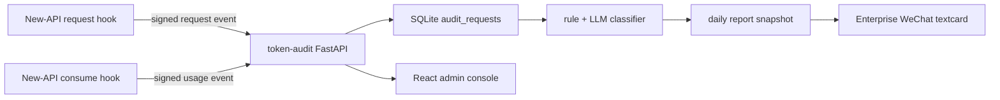

# Token Audit

New-API용 Token 사용량 및 업무 목적 감사 서비스입니다.

언어: [中文](../../README.md) | [English](README.en.md) | [日本語](README.ja.md) | 한국어

## 목적

`token-audit`는 독립적으로 실행되는 감사 서비스입니다. [Bigduang/new-api-audit](https://github.com/Bigduang/new-api-audit)가 전송하는 request event와 usage event를 받고, `request_id`로 prompt, 사용자, token, 모델, tokens, quota 등을 합쳐 로컬 SQLite에 저장합니다. 사용량이 안정된 뒤 일일 감사 리포트를 생성합니다.

실시간 제한이 아니라 사후 추적을 위한 서비스입니다:

- 사용자별, token별 요청 수, Prompt Tokens, Completion Tokens, Total Tokens, quota를 집계합니다.
- 개발, 디버깅, 아키텍처, 배포, 문서, 코드 리뷰, 데이터 분석 등 업무 목적 사용 여부를 판단합니다.
- 비업무 의심 또는 판단 불가 요청에 대해 사용자, token, 모델, tokens, 분류 이유, prompt preview를 보관합니다.
- 감사 대상 사용자 활성화/비활성화, 일일 리포트 표시 이름, 요청 기록, 전체 Prompt 확인을 위한 가벼운 관리자 화면을 제공합니다.
- 모바일 친화적인 HTML 일일 리포트를 생성하고 Enterprise WeChat textcard로 요약과 상세 링크를 보냅니다.
- SQLite와 30일 보존 정책을 사용하므로 VPS 기반 소규모 사내 중계 환경에 적합합니다.

## 현재 아키텍처

New-API 쪽은 최소 hook만 추가하여 감사 서비스가 정상 요청에 영향을 주지 않도록 합니다:

1. 요청 파싱 후 New-API가 request event를 보냅니다: 사용자, token, 모델, 요청 경로, prompt hash, prompt preview, 전체 prompt.
2. 사용량 정산 후 New-API가 usage event를 보냅니다: prompt tokens, completion tokens, quota, channel, group, 처리 시간, upstream request id.
3. `token-audit`는 `request_id` 기준으로 upsert하므로 request/usage event가 어느 순서로 도착해도 연결할 수 있습니다.
4. 전체 prompt는 SQLite에 AES-GCM으로 암호화 저장되며, 목록과 리포트는 기본적으로 짧은 preview만 표시합니다.
5. 관리자가 로그인하면 요청 기록의 dialog에서 필요할 때 전체 Prompt를 복호화해 볼 수 있습니다.
6. 분류와 리포트는 보통 다음 날 아침, 예를 들어 `06:05 Asia/Shanghai`에 전날 데이터를 대상으로 실행됩니다.



## 핵심 기능

- FastAPI로 New-API 내부 감사 이벤트를 수신합니다.
- HMAC-SHA256 검증과 timestamp replay window를 지원합니다.
- 단일 VPS 배포에 적합한 SQLite WAL 모드.
- dashboard, 사용자 목록, 요청 기록 조회를 빠르게 하기 위한 covering index.
- React + Vite + Tailwind 관리자 화면. Docker build 후 같은 Python 컨테이너가 정적 파일을 제공합니다.
- `audit_requests`는 요청, 사용자/token, 암호화 prompt ciphertext, 사용량, 연결 상태를 저장합니다.
- `audit_users`는 원본 요청 로그를 변경하지 않고 감사 사용자 설정을 저장합니다.
- `audit_classifications`는 rule/LLM 분류 결과와 수동 리뷰 상태를 저장합니다.
- `audit_user_work_summaries`는 사용자별 업무 내용 요약을 저장합니다.
- `audit_daily_reports`는 일일 리포트 HTML, summary JSON, Enterprise WeChat 응답을 저장합니다.
- `audit_events_deadletter`는 서명 실패, 잘못된 payload, 처리할 수 없는 event를 저장합니다.
- Enterprise WeChat textcard 전송으로 WeChat Markdown 렌더링 문제를 피합니다.
- UI의 큰 숫자는 `K/M/B`로 축약해 표시합니다.

## 관리자 화면

관리자 경로:

```text
https://ai-audit.example.com/admin/login
```

프론트엔드 스택:

- Vite + React + TypeScript
- Tailwind CSS
- lucide-react
- react-markdown + remark-gfm

운영 컨테이너에서는 Node를 실행하지 않습니다. Node는 Docker multi-stage build에서 `npm ci && npm run build`를 실행할 때만 사용됩니다.

관리자 화면 기능:

- `/admin/dashboard`: 안정적인 실시간 통계와 오늘 Top 5 사용량을 표시합니다. 일일 작업 전 오해를 줄 수 있는 분류 통계는 표시하지 않습니다.
- `/admin/users`: 기록에서 사용자를 찾고, 감사 대상 활성화/비활성화, 일일 리포트 표시 이름과 메모를 관리합니다.
- `/admin/users/{identity}`: 사용자 설정, 사용자 통계, 단일 사용자 요청 기록.
- `/admin/requests`: 전체 요청 기록. 사용자, token, 모델, 판정, 기간으로 필터링할 수 있습니다.
- `/admin/reports/daily`: 날짜별 일일 리포트 조회.

요청 기록에서 Prompt 처리:

- 목록은 큰 필드를 읽지 않도록 짧은 summary만 표시합니다.
- 요청을 클릭하면 별도의 상세 API를 호출합니다.
- 상세 API는 우선 `prompt_ciphertext`를 복호화하고 전체 Prompt를 Markdown으로 렌더링합니다.
- 과거 데이터에 ciphertext가 없거나 복호화에 실패했거나 New-API compact event인 경우 preview로 fallback하고 이유를 표시합니다.

## API

New-API 내부 연동 API:

| Method | Path | 설명 |
| --- | --- | --- |
| `POST` | `/internal/new-api/audit/request` | 요청 metadata와 prompt 수신 |
| `POST` | `/internal/new-api/audit/usage` | 최종 token/quota 사용량 수신 |

관리자 API:

| Method | Path | 설명 |
| --- | --- | --- |
| `GET` | `/admin/api/session` | 현재 로그인 상태와 CSRF token |
| `POST` | `/admin/api/login` | 관리자 로그인 |
| `POST` | `/admin/api/logout` | 로그아웃 |
| `GET` | `/admin/api/dashboard` | 감사 overview 통계 |
| `GET` | `/admin/api/users` | 감사 사용자 목록 |
| `PATCH` | `/admin/api/users/{identity_key}` | 표시 이름, 감사 대상 여부, 메모 수정 |
| `POST` | `/admin/api/users/sync` | 과거 요청에서 사용자 설정 동기화 |
| `GET` | `/admin/api/users/{identity_key}/requests` | 단일 사용자 요청 기록 |
| `GET` | `/admin/api/requests` | 전체 요청 기록 |
| `GET` | `/admin/api/requests/{request_id}/preview` | 전체 Prompt 복호화 반환 |
| `GET` | `/admin/api/report-url` | 관리자 iframe용 일일 리포트 URL |

운영 및 리포트 API:

| Method | Path | 설명 |
| --- | --- | --- |
| `GET` | `/health` | 헬스 체크 |
| `POST` | `/jobs/classify` | 지정 기간 요청 분류 |
| `POST` | `/jobs/summarize-work` | 사용자별 업무 내용 요약 |
| `POST` | `/jobs/cleanup` | 보존 기간이 지난 데이터 삭제 |
| `GET` | `/reports/token-usage` | 텍스트 사용량 리포트 |
| `GET` | `/reports/suspicious` | 텍스트 의심 요청 목록 |
| `GET` | `/reports/daily` | token으로 보호되는 HTML 일일 리포트 |
| `POST` | `/reports/push-wecom` | 리포트 snapshot 저장 및 Enterprise WeChat 전송 |
| `PATCH` | `/audit-requests/{request_id}/review` | 수동 리뷰 결과 기록 |

New-API 서명 요청에는 다음 header가 필요합니다:

```text
X-Audit-Timestamp: <unix timestamp>
X-Audit-Signature: hex(hmac_sha256(timestamp + "." + raw_body, AUDIT_SECRET))
```

## 데이터베이스 테이블

주요 SQLite 테이블:

| 테이블 | 설명 |
| --- | --- |
| `audit_requests` | 요청, 사용자/token, 암호화 prompt ciphertext, tokens, quota, 연결 상태 |
| `audit_users` | 감사 사용자 설정. 표시 이름, 일일 리포트 포함 여부, 메모 |
| `audit_classifications` | 분류 결과, 업무/비업무 판정, confidence, 리뷰 상태 |
| `audit_user_work_summaries` | LLM이 생성한 사용자별 업무 요약 |
| `audit_daily_reports` | 일일 리포트 HTML snapshot, summary JSON, Enterprise WeChat 응답 |
| `audit_events_deadletter` | 실패하거나 잘못된 payload |

`audit_users`는 장기 보존됩니다. 원본 상세, 분류, 리포트, 업무 요약은 `AUDIT_RETENTION_DAYS`에 따라 정리됩니다.

## 설정

템플릿 복사:

```bash
cp .env.example .env
```

32 byte prompt 암호화 키 생성:

```bash
python - <<'PY'
import base64, os
print("base64:" + base64.b64encode(os.urandom(32)).decode())
PY
```

서버 핵심 설정:

| 변수 | 기본값 | 설명 |
| --- | --- | --- |
| `AUDIT_DATABASE_URL` | `sqlite:///./token_audit.db` | SQLAlchemy database URL. 운영 환경은 보통 SQLite 파일 사용 |
| `AUDIT_SECRET` | empty | New-API와 공유하는 HMAC secret. 관리자 cookie 서명 키 파생에도 사용 |
| `AUDIT_PROMPT_ENCRYPTION_KEY` | empty | AES-GCM key. `base64:`, `hex:`, 일반 문자열 지원 |
| `AUDIT_SIGNATURE_TOLERANCE_SECONDS` | `300` | 서명 timestamp window |
| `AUDIT_TIMEZONE` | `Asia/Shanghai` | 리포트 표시 timezone |
| `AUDIT_RETENTION_DAYS` | `30` | 보존 기간 |
| `AUDIT_MAX_BODY_BYTES` | `2097152` | 수신 body 최대 크기 |
| `AUDIT_PUBLIC_BASE_URL` | empty | HTML 리포트 공개 URL prefix |
| `AUDIT_REPORT_ACCESS_TOKEN` | empty | `/reports/daily` access token |

관리자 화면:

| 변수 | 기본값 | 설명 |
| --- | --- | --- |
| `AUDIT_ADMIN_USER` | empty | 관리자 사용자명 |
| `AUDIT_ADMIN_PASSWORD` | empty | 관리자 비밀번호 |
| `AUDIT_ADMIN_SESSION_TTL_SECONDS` | `43200` | 관리자 cookie 유효 시간 |

LLM 분류와 업무 요약:

| 변수 | 설명 |
| --- | --- |
| `AUDIT_LLM_ENABLED` | OpenAI-compatible LLM 활성화 |
| `AUDIT_LLM_BASE_URL` | 예: `https://api.deepseek.com` |
| `AUDIT_LLM_API_KEY` | LLM API key. git에 커밋하지 마세요 |
| `AUDIT_LLM_MODEL` | 예: `deepseek-v4-flash` |
| `AUDIT_LLM_TIMEOUT_SECONDS` | 분류 요청 timeout |
| `AUDIT_LLM_MIN_CONFIDENCE` | 이 confidence 미만이면 rule 결과를 유지하거나 덮어쓰지 않음 |

Enterprise WeChat:

| 변수 | 설명 |
| --- | --- |
| `WX_CORPID` | 기업 ID |
| `WX_APPSECRET` | 앱 secret |
| `WX_AGENT_ID` | 앱 AgentId |

## Docker 배포

현재 운영 구성은 CPA + New-API + token-audit가 같은 Docker host에서 실행되는 형태입니다. `token-audit`를 New-API와 같은 Docker network에 붙이면 New-API가 service name으로 접근할 수 있습니다:

```env
AUDIT_ENDPOINT=http://token-audit:8000
```

build 및 시작:

```bash
mkdir -p data
docker compose -f deploy/docker-compose.yml build
docker compose -f deploy/docker-compose.yml up -d
docker logs -f token-audit
```

`deploy/docker-compose.yml`은 기본적으로 외부 네트워크 `proxy_newapi-network`에 참여합니다. New-API compose project의 network 이름이 다르면 수정하세요:

```yaml
networks:
  newapi-network:
    external: true
    name: proxy_newapi-network
```

컨테이너 entrypoint는 Uvicorn 시작 전에 다음을 실행합니다:

```bash
python -m token_audit.cli migrate
```

## New-API 연동

서버에서 수동 patch하지 말고 감사 hook이 포함된 [Bigduang/new-api-audit](https://github.com/Bigduang/new-api-audit) fork 사용을 권장합니다. `patches/new-api-audit-hook.patch`는 과거 참고용으로만 남겨둡니다.

New-API 권장 설정:

```env
AUDIT_ENABLED=true
AUDIT_ENDPOINT=http://token-audit:8000
AUDIT_SECRET=<same-as-token-audit>
AUDIT_TIMEOUT_MS=800
AUDIT_QUEUE_SIZE=1000
AUDIT_MAX_EVENT_BYTES=1048576
AUDIT_EXCLUDED_TOKEN_NAMES=audit-classifier
```

권장 rollout:

1. `token-audit`를 배포하고 `/health`를 확인합니다.
2. New-API fork image를 `AUDIT_ENABLED=false`로 배포합니다.
3. `AUDIT_ENABLED=true`를 켜서 shadow reporting을 시작합니다.
4. New-API health, container logs, token-audit 입고, deadletter를 확인합니다.
5. request/usage 연결이 완전해진 뒤 daily cron을 활성화합니다.

감사 sender는 non-blocking queue입니다. 감사 서비스 장애, queue full, 이벤트 크기 초과가 있어도 New-API는 로그 기록 또는 compact event 전송만 하고 사용자 요청을 중단하지 않습니다.

## 일상 작업

지정 날짜 분류:

```bash
python -m token_audit.cli classify --start 2026-06-02 --end 2026-06-02
```

각 사용자가 작업한 기능 요약:

```bash
python -m token_audit.cli summarize-work --start 2026-06-02 --end 2026-06-02
```

push 없이 리포트 snapshot만 저장:

```bash
python -m token_audit.cli save-report --start 2026-06-02 --end 2026-06-02
```

Enterprise WeChat 일일 리포트 전송:

```bash
python -m token_audit.cli push-wecom --start 2026-06-02 --end 2026-06-02
```

만료 데이터 cleanup:

```bash
python -m token_audit.cli cleanup
```

Docker 운영 script:

```bash
/opt/token-audit/deploy/scripts/run-daily-audit.sh 2026-06-02
```

권장 cron:

```cron
05 6 * * * /opt/token-audit/deploy/scripts/run-daily-audit.sh >> /opt/token-audit/data/daily-audit.log 2>&1
```

이 script는 `classify`, `summarize-work`, `push-wecom`, `cleanup`을 순서대로 실행합니다.

분류는 실시간이 아닙니다. 당일 관리자 화면 요청 기록이 일시적으로 "미분류"로 보이는 것은 정상이며, 다음 날 아침 작업 완료 후 분류 결과가 반영됩니다.

## 리포트 접근

일일 리포트 상세 URL:

```text
https://ai-audit.example.com/reports/daily?date=2026-06-02&token=<AUDIT_REPORT_ACCESS_TOKEN>
```

HTTP 예시:

```bash
curl 'http://localhost:8000/reports/token-usage?start=2026-06-02&end=2026-06-02'
curl 'http://localhost:8000/reports/suspicious?start=2026-06-02&end=2026-06-02'
curl -X POST 'http://localhost:8000/jobs/classify?start=2026-06-02&end=2026-06-02'
curl -X POST 'http://localhost:8000/jobs/summarize-work?start=2026-06-02&end=2026-06-02'
```

Public nginx는 일반적으로 `/jobs/*`, `/reports/token-usage`, `/reports/suspicious`를 노출하지 않습니다. 꼭 노출해야 한다면 추가 인증을 넣으세요. 보통은 `/admin/*`와 `/reports/daily`만 proxy하며, `/admin/*`는 관리자 로그인으로, `/reports/daily`는 `AUDIT_REPORT_ACCESS_TOKEN`으로 보호합니다.

## 수동 리뷰

```bash
curl -X PATCH http://localhost:8000/audit-requests/<request_id>/review \
  -H 'Content-Type: application/json' \
  -d '{"review_status":"confirmed","review_note":"non-work chat","reviewed_by":"admin"}'
```

`review_status` 값:

- `pending`
- `confirmed`
- `false_positive`
- `ignored`

## 개발

Backend:

```bash
python -m venv .venv
. .venv/bin/activate
pip install -e .
pip install -r requirements-dev.txt
pytest -q
```

Frontend:

```bash
cd frontend/admin
npm ci
npm run build
```

로컬 시작:

```bash
export $(grep -v '^#' .env | xargs)
python -m token_audit.cli migrate
uvicorn token_audit.main:app --host 0.0.0.0 --port 8000
```

## 보안 주의사항

- `.env`, SQLite DB, logs, 리포트 export, 실제 API key를 커밋하지 마세요.
- `AUDIT_PROMPT_ENCRYPTION_KEY`를 잃으면 과거 전체 prompt를 복호화할 수 없습니다. 반드시 안전하게 backup하세요.
- 요청 기록, 리포트, Enterprise WeChat push는 기본적으로 prompt preview만 표시합니다.
- 전체 Prompt 보기는 관리자 로그인이 필요하며 단일 요청을 열 때만 복호화합니다.
- LLM 분류와 업무 요약은 rule로 선별된 prompt 내용을 사용합니다. 분류기 token 이름은 `AUDIT_EXCLUDED_TOKEN_NAMES`에 추가하세요.
- Enterprise WeChat push는 summary card만 보내며 전체 상세는 token으로 보호된 HTML 페이지에 남겨둡니다.

## 현재 운영 약속

- Database: SQLite.
- 상세 데이터 보존: 30일.
- 감사 시간: 매일 아침 06:05 전후, 전날 데이터 처리.
- 관리자 경로: `/admin/login`.
- New-API 정상 traffic이 우선이며 감사 실패가 중계 서비스 가용성에 영향을 주면 안 됩니다.

## Friendly Links

- [LinuxDO](https://linux.do/): 고품질 기술 커뮤니티.

## License

This project is open-sourced under the [MIT License](../../LICENSE).
